<div align="center">

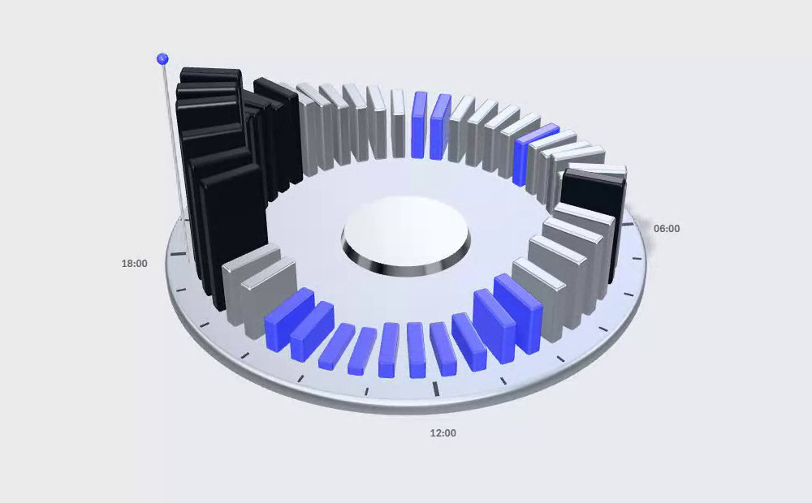

# Lowtide

**Ask Alexa when to run the dishwasher. Lowtide answers from tonight's real electricity prices.**

An MCP server for Alexa+ that reads every half-hourly price and the grid's carbon forecast,<br>
and plans the dishwasher, the washing, the hot water and the car for the cheapest, cleanest time.

[](https://lowtide-energy.vercel.app)
[](https://lowtide-energy.vercel.app/connect)
[](https://lowtide-energy.vercel.app/echo)
[](https://github.com/RohanGlitched/lowtide/actions/workflows/ci.yml)
[](LICENSE)

[**Try it on the Echo**](https://lowtide-energy.vercel.app/echo) · [Add it to Claude or ChatGPT](https://lowtide-energy.vercel.app/connect) · [Today's prices, region by region](https://lowtide-energy.vercel.app/tables)

</div>

---

## The problem

Millions of homes now pay a different price for electricity every half hour: Octopus Agile in Britain, ComEd Hourly Pricing in Illinois, dynamic tariffs across Germany. The same dishwasher cycle can cost 9p at one in the morning and 43p at six in the evening, and the grid is often half as dirty at night. But nobody reads a price table while loading the dishwasher.

The question is always the same, and it's asked in the kitchen with your hands full: **"When should I run it?"** That's a voice question. Lowtide is the answer.

## What it does

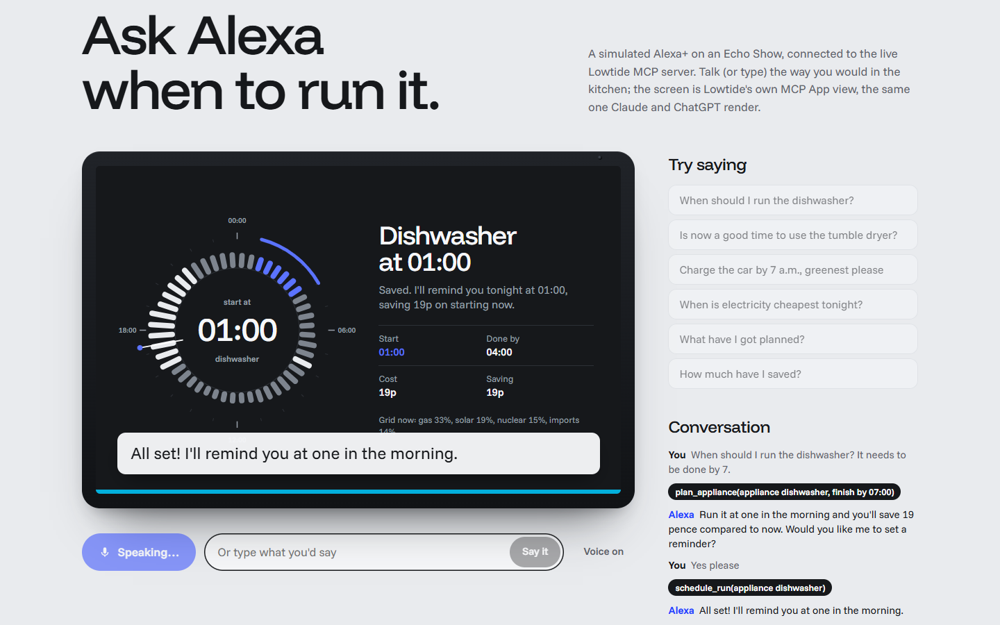

> **You:** Alexa, when should I run the dishwasher? It needs to be done by seven.
> **Alexa:** Run it at one in the morning and you'll save 17 pence compared to now. Would you like me to set a reminder?
> **You:** Yes please.
> **Alexa:** All set, I'll remind you at one in the morning.

That exchange is real: Claude Haiku 4.5 on Amazon Bedrock, calling Lowtide's MCP tools, with London's live Agile prices. The answer comes back twice: **a sentence to speak**, and **an MCP App view for the Echo Show screen**, the next 24 hours on a dial with the run marked on the rim.

- **Plans any shiftable load** (dishwasher, washing machine, tumble dryer, EV, immersion heater, home battery), with a deadline ("done by seven"), an earliest start ("not before ten"), and a goal: cheapest, greenest, or both.
- **Remembers the household:** saved runs, reminders and money saved, behind a private household link (no account, no name).
- **Real prices everywhere:** Octopus Agile for every British postcode (all 14 regions), ComEd day-ahead hourly prices for northern Illinois, EPEX day-ahead for Germany, and the National Energy System Operator's regional carbon forecast.

## The day, machined

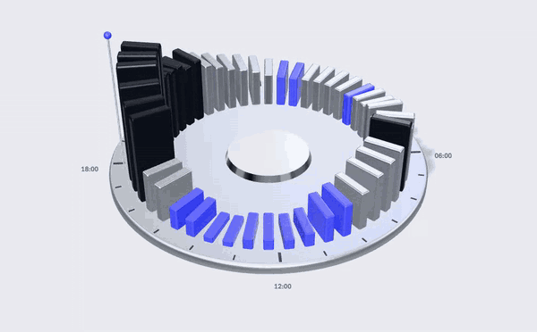

The website turns each day into an object: a studio-lit ring of 48 aluminium fins (three.js), one per half hour, height = price. The cheapest quarter is anodised cobalt, the dearest graphite, and a polished pin stands at "now". Switch city and it re-cuts itself from that region's live prices. The Echo's screen shows the same object from above.

## Try it in one minute

1. Open **[lowtide-energy.vercel.app/echo](https://lowtide-energy.vercel.app/echo)**. A demo household in London is set up for you, with two weeks of past runs priced at the real rates of those nights.
2. Press **Talk to Alexa** (or type). Try: *"When should I run the dishwasher?"*, then *"Yes please"*, then *"How much have I saved?"*
3. Watch the right-hand column: every MCP tool call Alexa makes is listed as it happens.
4. Want it in your own assistant? **[Make a household link](https://lowtide-energy.vercel.app/connect)** and add it to Claude (Settings → Connectors → Add custom connector) or ChatGPT (developer mode → Create).
5. Or open it in **[Countertop](https://countertop-mcp.vercel.app/?server=https://lowtide-energy.vercel.app/api/mcp)**, the open-source voice and screen test bench for MCP servers that came out of this project ([source](https://github.com/RohanGlitched/countertop)).

## Screens

| | |
|---|---|
| 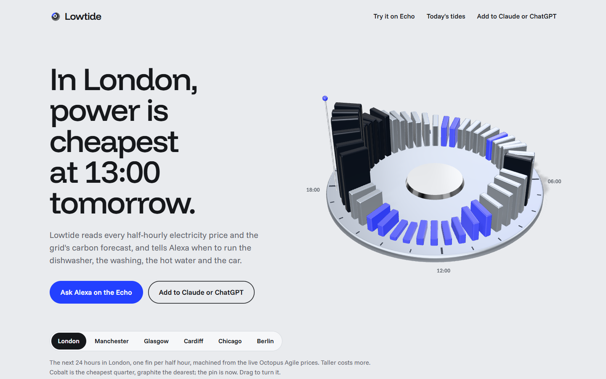 | 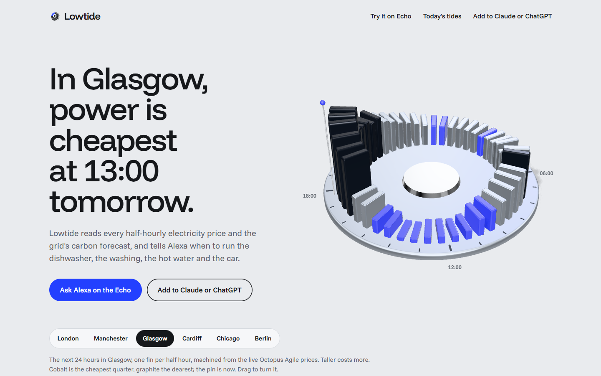 |
| **Home.** The headline is live data; the ring is the next 24 hours in London. | **Glasgow.** Every region gets a different object every day. |
| 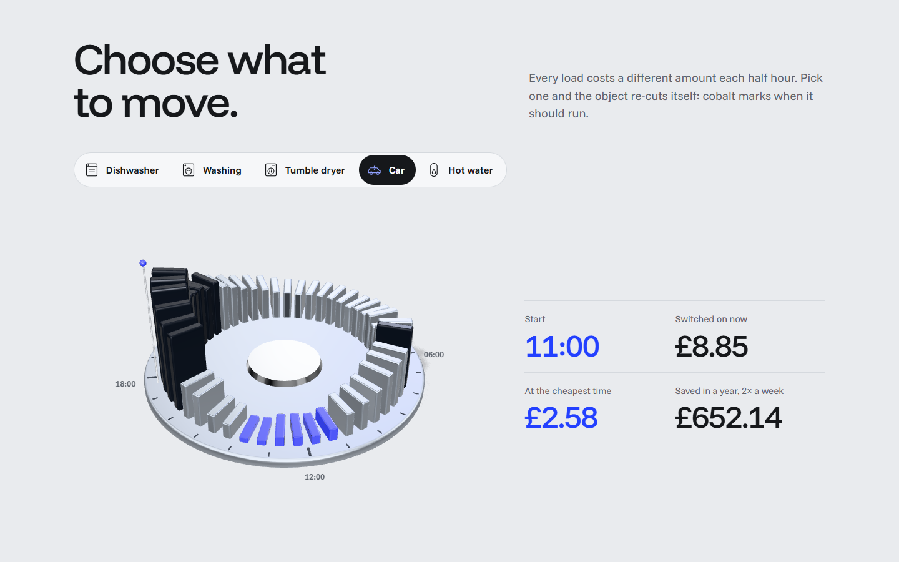 | 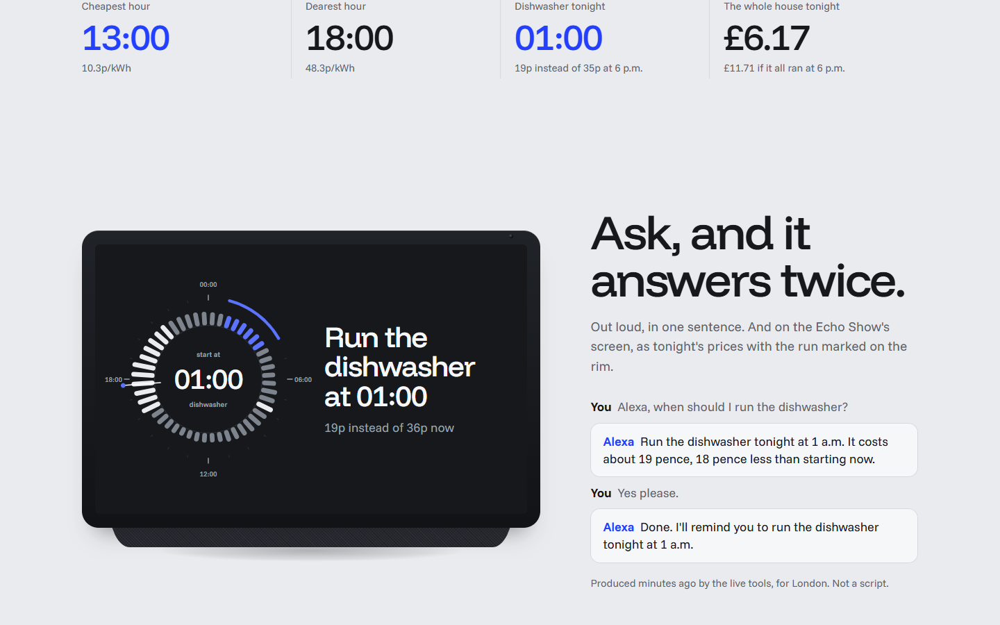 |
| **Choose what to move.** Pick a load; cobalt marks when it should run, with the saving. | **Ask, and it answers twice.** The live answer for London, spoken and drawn. |
| 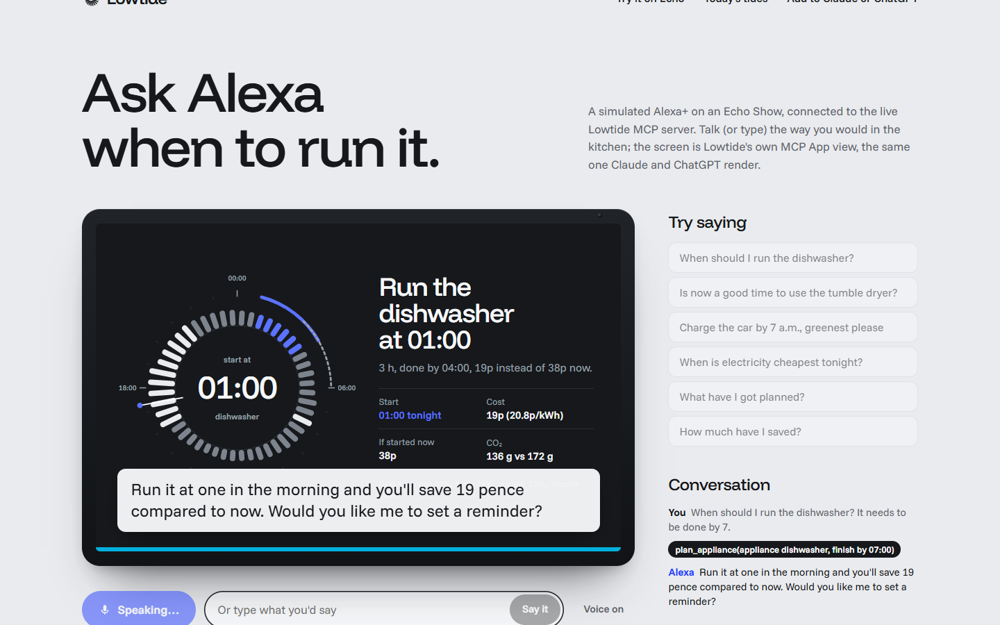 | 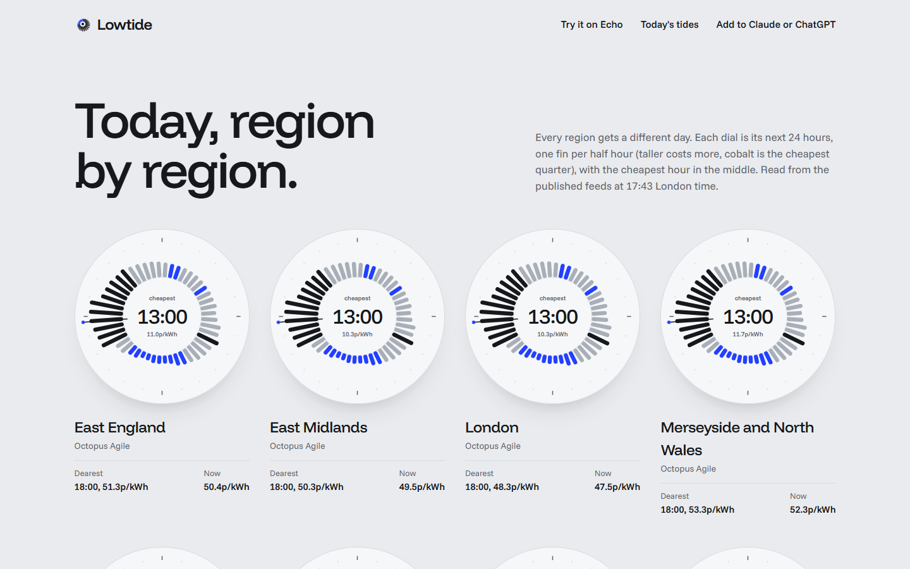 |
| **Echo simulator.** Bedrock picks the tool; the MCP App view renders on the screen. | **Today, region by region.** 14 Agile regions, Illinois and Germany. |

<p align="center">
  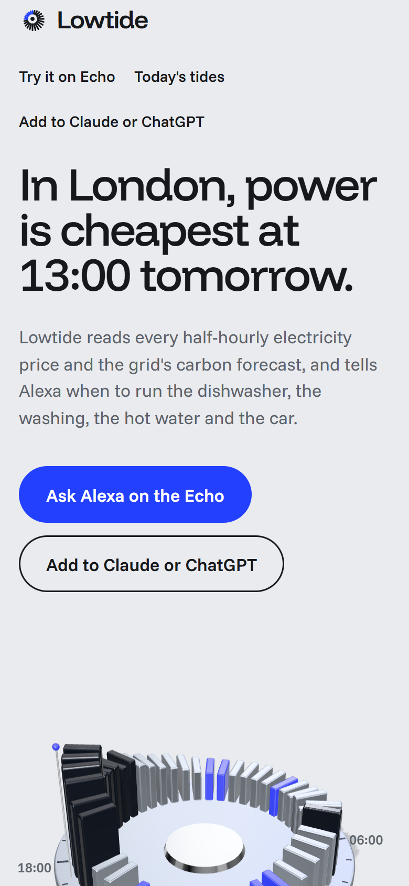
  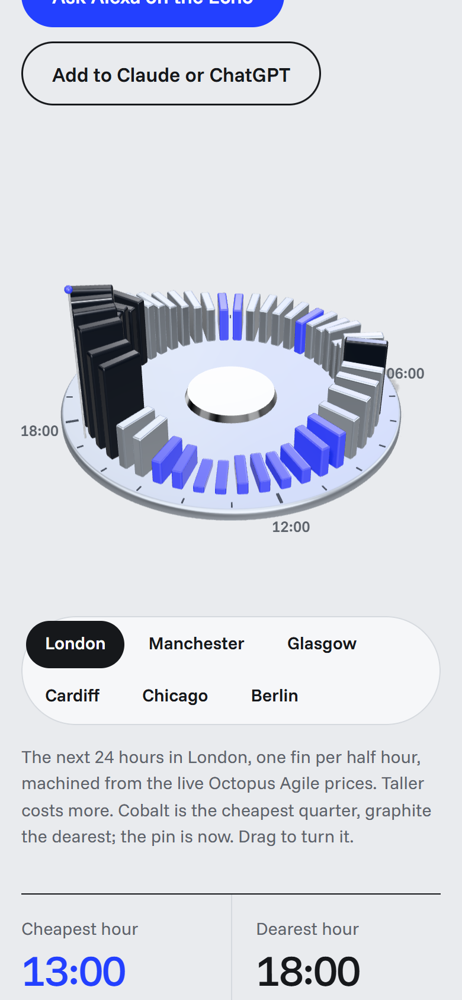
  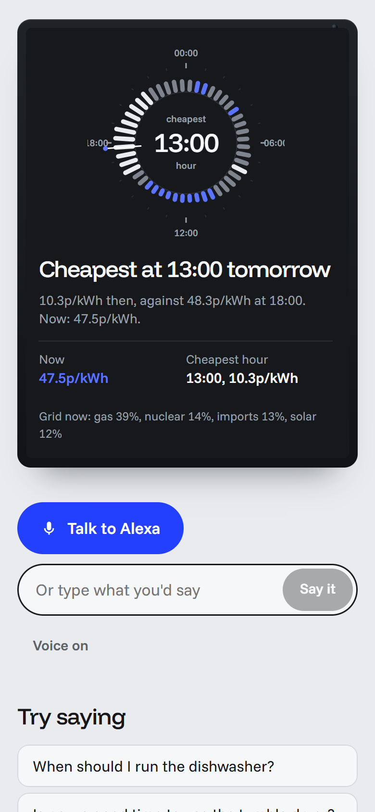
</p>

## How it works

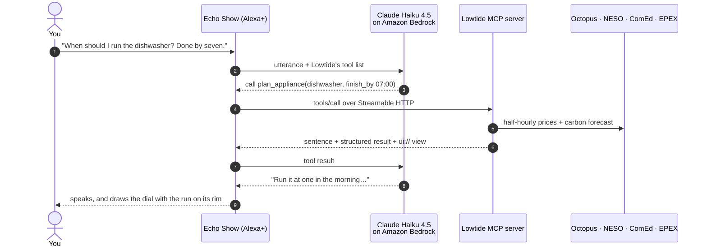

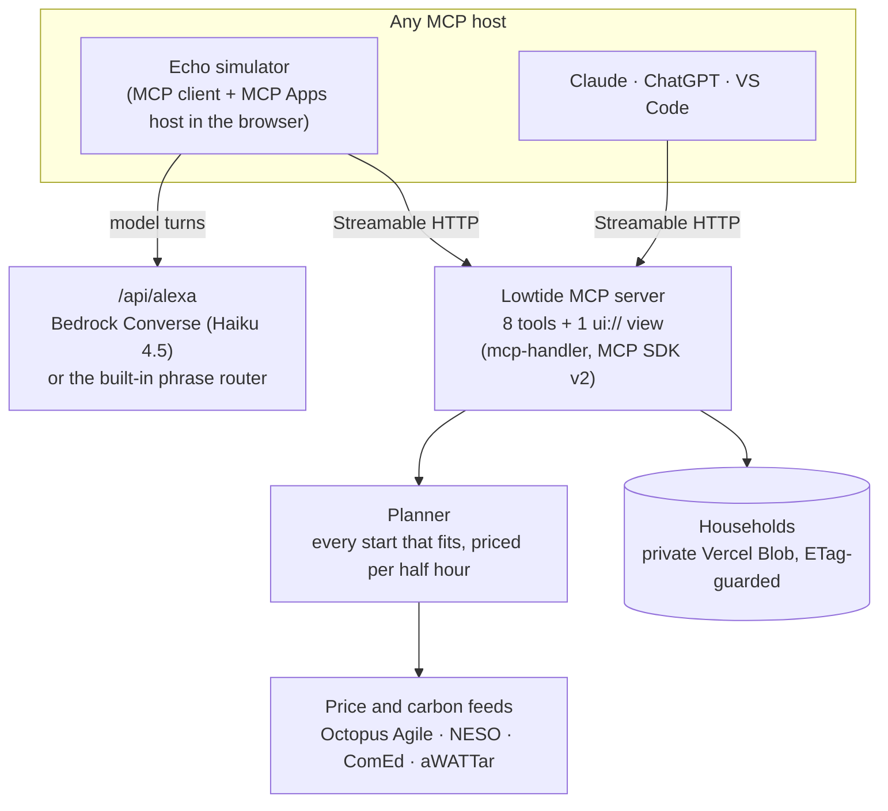

### The tools

| Tool | What it does | Shows a view |
|---|---|---|
| `plan_appliance` | Cheapest or greenest start for a load, with an optional deadline and earliest start; compares with starting now | ✓ |
| `schedule_run` | Saves the run once the person agrees, with its saving | ✓ |
| `check_now` | Whether this half hour is cheap or dear, and when it drops | ✓ |
| `get_tide` | The next 24 hours of prices and carbon, with the cheapest and dearest hours | ✓ |
| `list_runs` / `cancel_run` | The household's planned runs | ✓ |
| `get_savings` | Money and CO₂ saved by running at the cheap hours | ✓ |
| `set_home` | Postcode or city, which picks the tariff region | |

Every tool returns a **voice-ready sentence** first (times said the way people say them, money in pence or cents), a **structured result** for the view, and, for `plan_appliance`, a line the model uses for `schedule_run` but never reads aloud. The server ships its own instructions, and the repo ships an **Agent Skill** ([`skills/lowtide/SKILL.md`](skills/lowtide/SKILL.md)) for skills-aware agents.

### Built for a voice device

- **The answer leads.** "Run the dishwasher at 01:00" is the headline on screen and the first words spoken.
- **Readable across a kitchen.** The view has a fullscreen layout for device screens (sized from the screen, nothing scrolls) and an inline one for chat hosts.
- **Never stuck.** If Bedrock is unavailable or the daily budget is spent, the simulator falls back to a deterministic phrase router that calls the same tools, and the tools' own sentences are spoken.
- **Bounded cost.** 40 model calls per visitor per 10 minutes, 1,500 per day, counted across instances.

## Engineering notes

- **MCP:** `mcp-handler` 2 with MCP SDK v2 serves the 2026-07-28 spec natively and falls back to 2025-era stateless Streamable HTTP from the same route. One endpoint per household (`/api/mcp/h/<id>`), plus a guest endpoint for questions that name a place.
- **MCP Apps:** the `ui://lowtide/tide-chart.html` resource is one self-contained HTML file (esbuild), using `@modelcontextprotocol/ext-apps`. The Echo simulator hosts it in an opaque-origin sandboxed iframe through `AppBridge`, the same protocol Claude and ChatGPT use.
- **Prices:** Agile rates by region letter (postcode → grid supply point), NESO regional carbon by region id, ComEd's day-ahead feed parsed from Chicago wall-clock time, aWATTar EUR/MWh → ct/kWh. Feeds are cached two minutes and fail one at a time.
- **Planner:** every half-hour start that finishes in time is priced by spreading the load evenly over the slots it covers (partial slots included); "balanced" normalises cost and carbon distance from each optimum. Negative prices count as a credit.
- **Storage:** one private Vercel Blob document per household, read uncached and written with `ifMatch` ETags. Blob ETags can lag right after an overwrite, so demo households are written once and updates retry with backoff.
- **Performance:** the 3D object renders on demand (static shadow map, 30 fps idle turn, paused off screen), compiles shaders asynchronously, and mounts in idle time.

## Proof

| Claim | Where it's checked |
|---|---|
| The planner picks the cheapest and greenest windows, respects deadlines, handles partial slots and negative prices | [`web/test/plan.test.ts`](web/test/plan.test.ts) |
| Times survive DST and time zones; "7am", "7:30 p.m.", "noon" and ISO all parse | [`web/test/time.test.ts`](web/test/time.test.ts) |
| Postcodes and cities resolve to the right tariff; money reads naturally | [`web/test/time.test.ts`](web/test/time.test.ts) |
| The fallback router maps everyday phrasings, and "yes" schedules the plan just offered | [`web/test/fallback.test.ts`](web/test/fallback.test.ts) |
| Every tool works over Streamable HTTP against the live deployment | [`web/scripts/mcp-smoke.mjs`](web/scripts/mcp-smoke.mjs), run in CI |
| A full Bedrock conversation (plan → schedule → savings) works in production | [`web/scripts/alexa-turn.mjs`](web/scripts/alexa-turn.mjs) |
| The Echo flow works on desktop and phone with no console errors | [`web/scripts/e2e.cjs`](web/scripts/e2e.cjs) |

## Run it

```bash
cd web
npm install
npm run dev          # builds the MCP App view, then starts Next.js
npm test             # 20 unit tests
node scripts/mcp-smoke.mjs http://localhost:3000
```

Optional environment (see [`web/.env.example`](web/.env.example)): `BLOB_READ_WRITE_TOKEN` (households; without it they're stored in `web/.data`), `AWS_BEARER_TOKEN_BEDROCK` (the simulator's model; without it the phrase router answers).

## What's next

- Matter smart plugs and appliance APIs, so a confirmed plan can start the machine itself.
- More tariffs: Octopus Go and Intelligent, PG&E time-of-use, Tibber; and WattTime carbon for the US.
- Proactive notifications on the Echo when tonight's prices land ("tonight is unusually cheap, run the dryer").

## Feedback for the Amazon teams

The friction we hit while building is logged in [`FRICTION.md`](FRICTION.md).

---

Built for the [Amazon Build, Ship, Shape hackathon](https://amazonappdev2026.devpost.com) (Alexa+ track, AWS Builder mini challenge), October 2026. Prices: Octopus Energy, ComEd, aWATTar; carbon: National Energy System Operator. Not affiliated with Amazon, Octopus Energy or ComEd.

MIT licensed.
